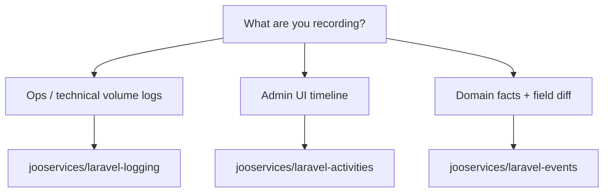

# Ecosystem Decision Tree

JOOservices ships three complementary Laravel packages for durable records. Choose
by **audience** and **query pattern**, not by storage backend alone.

## jooservices/laravel-logging

**Use for:** high-volume operational logs — job lifecycles, HTTP traces,
integration failures, system events.

**Characteristics:**

- MongoDB `activity_logs` collection
- Structured adapters (`activity`, `audit`, `security`, `domain`, `system`) plus custom ops adapters
- Async `queue()->dispatch()` for non-blocking writes
- Retention, export, promoted fields for indexable ops dimensions

**Do not use for:** human-facing extension timelines (use activities) or
immutable compliance event streams with field-level diff (use events).

## jooservices/laravel-activities

**Use for:** user-facing admin timelines — who did what, when, on which subject.

**Characteristics:**

- Optimized for UI pagination and subject-scoped feeds
- Lighter payload model oriented toward display

**Do not use for:** crawl telemetry, HTTP traces, or high-cardinality ops logs.

## jooservices/laravel-events

**Use for:** domain facts and compliance — plugin config changes, activation,
validation outcomes with before/after field diff.

**Characteristics:**

- Append-only event log semantics
- Replay and audit-oriented projections

**Do not use for:** crawl ops logs or admin activity timelines.

## Typical app wiring

| Concern | Package | Example |
|---------|---------|---------|
| Crawl job started/failed/HTTP | logging | Custom `ops` adapter, promoted `site_id` |
| Admin dispatched a crawl target | activities | `crawl_target.dispatched` on subject |
| Plugin config field changed | events | `PluginConfigChanged` with diff payload |

All three may share correlation IDs (`correlation_id`, `batch_id`) so operators
can jump from a UI timeline entry to ops logs or compliance events.

**Composer wiring:** this package depends on `jooservices/dto` and
`jooservices/laravel-repository` only. It does **not** depend on
`jooservices/laravel-events`. When an application needs both logging and
events, dispatch each from the app and share IDs — do not route logs through
`EventService`.

## Related docs

- [Adapter cookbook](08-adapter-cookbook.md)
- [Cookbook examples](../03-examples/01-cookbook.md)
- [laravel-activities](https://github.com/jooservices/laravel-activities)
- [laravel-events](https://github.com/jooservices/laravel-events)
